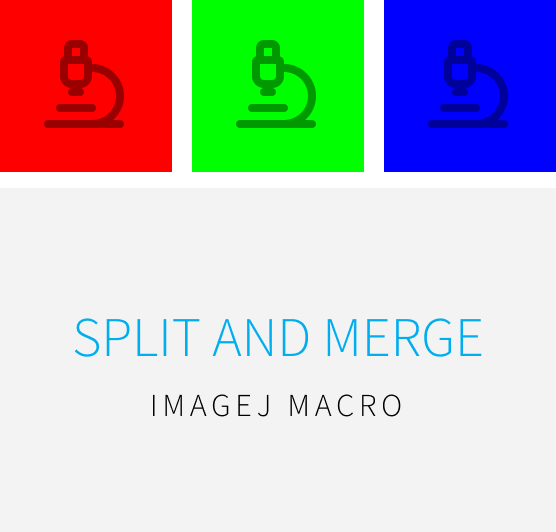

# Split and Merge
Tagged image file format (TIFF) images acquired from fluorescent microscopes often contain multi-dimensional and multi-channel data. It is often required to split or rearrange the dimensionality and channels containing fluorescent intensity data. Split and Merge is a Fiji/ImageJ macro that eases this process by allowing a single-file multidimensional TIFF stack to be split into separate files, or by merging together separate files into a single TIFF stack.

## Dependencies

This macro has been tested with the latest versions of Fiji/ImageJ.

## Usage

## Turku BioImaging

This plugin is part of the [Bioimage Analysis Toolbox
](https://www.bioimaging.fi/bioimage-analysis-toolbox/) created by [Turku BioImaging](https://bioimaging.fi), a broad-based, interdisciplinary science and infrastructure umbrella that aims to unite bioimaging expertise in Turku and elsewhere in Finland. Turku BioImaging is jointly operated by the [University of Turku](https://utu.fi) and [Åbo Akademi University](https://abo.fi).

For plugin support, [file an issue](https://github.com/Turku-BioImaging/split-and-merge/issues/new) in this repository.

For more information, email [image-data@bioimaging.fi](mailto:image-data@bioimaging.fi)

    

